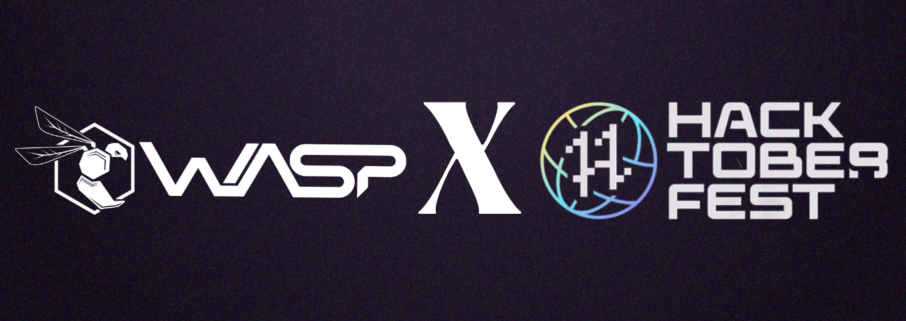

# Hacktoberfest Page Owasp-tiet

A website made with [:heart] by Owasp-tiet containing all the projects of owasp-tiet participating in Hacktoberfest.
The website contains following projects:
- [Web Dev Tasks]("https://github.com/OWASP-STUDENT-CHAPTER/WebDev-Tasks")
- [Tech Think Tank]("https://github.com/OWASP-STUDENT-CHAPTER/TechThinkTank")
- [Algorithm Visualizer]("https://github.com/OWASP-STUDENT-CHAPTER/Algorithm-Visualizer")
- [Tab Saver Extension]("https://github.com/OWASP-STUDENT-CHAPTER/TabSaverExtension")
- [Backend Automation using NPM]("https://github.com/OWASP-STUDENT-CHAPTER/backend-automation")

<!-- This project is built using the MERN stack.  -->

# OWASP Student Chapter, TIET

   

<h3 align="center">Thapar Institute of Engineering and Technology (TIET) has been a steady source of highly skilled talent to the nation as well as overseas. A pioneer in engineering education, research and innovation. The team of OWASP Student Chapter, one of the gilt-edged coding society, involves ingenious mind solvers who are eager to make the world a better place to live in with their innovative techniques and discoveries. By successfully organising many hackathons, tech-talks, workshops and coding nights, we have always strived hard to maintain the coding culture throughout the campus.</h3> 

Check out our work at [owasp.co.in](http://owasp.co.in) 

## Contact Us

<h3>

[Instagram](https://www.instagram.com/owasp_tiet/)
</h3>

<h3>

[Github](https://github.com/OWASP-STUDENT-CHAPTER)
</h3>

<h3>

[Twitter](https://twitter.com/Owasp_tiet)
</h3>

<h3>

[Linkedin](https://www.linkedin.com/company/owasp-tiet/)
</h3>

